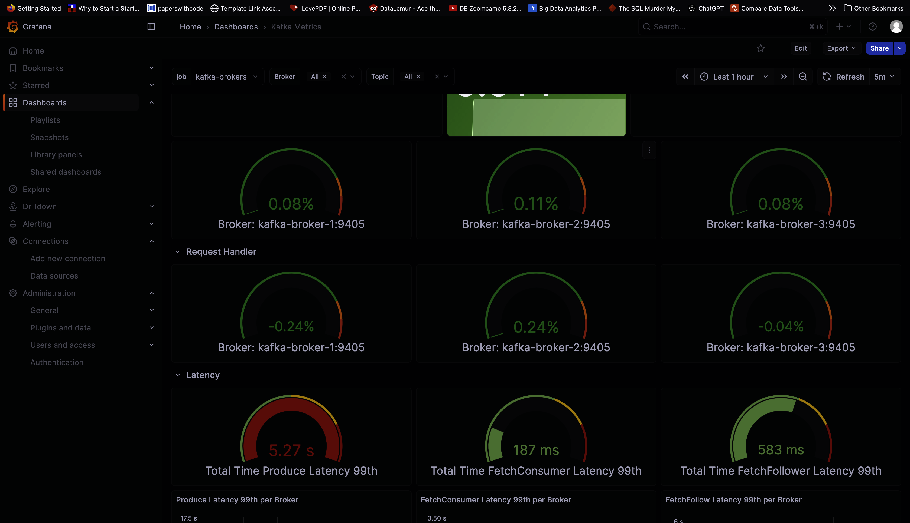

# Kafka-Spark Streaming Data Processing Project

A comprehensive real-time data streaming platform that demonstrates end-to-end processing of financial transaction data using Apache Kafka for event streaming and Apache Spark for stream processing, with full observability and monitoring capabilities.

## 🎯 Project Overview

This project implements a production-ready streaming data pipeline that:
- **Ingests** financial transaction data from multiple producers (Python and Java)
- **Processes** streaming data in real-time using Apache Spark Structured Streaming
- **Aggregates** transaction data by merchant for analytics
- **Monitors** the entire infrastructure with Prometheus, Grafana, and ELK stack
- **Provides** a web-based UI for Kafka topic management (Kafka Console)

## 🏗️ Architecture

```
┌─────────────────┐     ┌──────────────────┐     ┌─────────────────┐
│  Data Producers │────▶│  Kafka Cluster   │────▶│  Spark Streaming│
│  (Python/Java)  │     │  3 Controllers   │     │   Processor     │
│                 │     │  3 Brokers       │     │                 │
└─────────────────┘     └──────────────────┘     └─────────────────┘
                               │                          │
                               │                          ▼
                        ┌──────┴──────┐        ┌─────────────────┐
                        │   Monitoring│        │ Output Topics   │
                        │  Prometheus │        │ (Aggregates)    │
                        │   Grafana   │        └─────────────────┘
                        │   ELK Stack │
                        └─────────────┘
```

### Components

#### **Kafka Infrastructure**
- **3 Kafka Controllers**: Managing cluster metadata and coordination (Node IDs: 1, 2, 3)
- **3 Kafka Brokers**: Handling message storage and replication (Node IDs: 4, 5, 6)
- **Schema Registry**: Managing Avro schemas for data serialization
- **Kafka Console**: Web UI for topic browsing and management (Redpanda Console)

#### **Spark Processing**
- **Spark Master**: Cluster coordinator
- **3 Spark Workers**: Distributed processing nodes
- **Streaming Job**: Real-time transaction aggregation

#### **Monitoring Stack**
- **Prometheus**: Metrics collection and storage
- **Grafana**: Visualization and dashboards
- **Elasticsearch**: Log storage and search
- **Logstash**: Log processing and transformation
- **Filebeat**: Log shipping from Kafka nodes
- **Alertmanager**: Alert management

## 📋 Prerequisites

- **Docker** 20.10+ and **Docker Compose** 2.0+
- **Python** 3.8+ (for Python producer)
- **Java** 11+ (for Java producer)
- **Maven** 3.6+ (for Java producer build)
- Minimum **8GB RAM** and **4 CPU cores** recommended
- Ports available: `29092, 39092, 49092, 8080, 18081, 3000, 9090, 5601, 9200, 9190, 7077, 4040`

## 🚀 Quick Start

### 1. Clone the Repository

```bash
git clone <repository-url>
cd KafkaSparkProject
```

### 2. Start the Infrastructure

```bash
docker-compose up -d
```

This starts:
- Kafka cluster (3 controllers + 3 brokers)
- Schema Registry
- Kafka Console
- Spark cluster (1 master + 3 workers)
- Monitoring stack (Prometheus, Grafana, ELK)

**Expected startup time**: 2-3 minutes

### 3. Verify Services

Check service health:

```bash
# Check Kafka brokers
docker exec kafka-broker-1 kafka-topics --bootstrap-server localhost:9092 --list

# Check Spark master
curl http://localhost:9190

# Check services status
docker-compose ps
```

### 4. Run Data Producers

#### Option A: Python Producer

```bash
# Install dependencies
pip install confluent-kafka

# Run producer
python main.py
```

#### Option B: Java Producer

```bash
cd JavaCode

# Build project
mvn clean package

# Run producer
java -cp target/JavaCode-1.0-SNAPSHOT.jar:../jars/* \
  com.nifesimiproject.TransactionProducer
```

Both producers will:
- Create the `financial_transactions` topic (if it doesn't exist)
- Start producing transaction data with 3 parallel threads
- Generate ~10 messages/second per thread

### 5. Run Spark Streaming Job

```bash
# Submit Spark job
docker exec -it spark-master bin/spark-submit \
  --master spark://spark-master:7077 \
  --jars /opt/bitnami/spark/custom-jars/spark-sql-kafka-0-10_2.13-4.0.0.jar,\
/opt/bitnami/spark/custom-jars/kafka-clients-3.4.1.jar,\
/opt/bitnami/spark/custom-jars/commons-pool2-2.12.0.jar,\
/opt/bitnami/spark/custom-jars/spark-token-provider-kafka-0-10_2.13-4.0.0.jar \
  /opt/bitnami/spark/jobs/spark_processor.py
```

Or using the Spark UI:

```bash
docker exec -it spark-master bin/spark-submit \
  --master spark://spark-master:7077 \
  --packages org.apache.spark:spark-sql-kafka-0-10_2.13:4.0.0 \
  /opt/bitnami/spark/jobs/spark_processor.py
```

## 📊 Accessing Services

### Web UIs

| Service | URL | Description |
|---------|-----|-------------|
| **Kafka Console** | http://localhost:8080 | Browse topics, messages, and consumer groups |
| **Schema Registry** | http://localhost:18081 | Manage Avro schemas |
| **Spark Master UI** | http://localhost:9190 | Monitor Spark cluster and jobs |
| **Grafana** | http://localhost:3000 | Metrics visualization (default: admin/admin) |
| **Prometheus** | http://localhost:9090 | Metrics query interface |
| **Kibana** | http://localhost:5601 | Log analysis and visualization |
| **Elasticsearch** | http://localhost:9200 | Log storage API |

### Kafka Broker Endpoints

| Broker | External Port | Internal Address |
|--------|--------------|------------------|
| Broker 1 | `localhost:29092` | `kafka-broker-1:19092` |
| Broker 2 | `localhost:39092` | `kafka-broker-2:19092` |
| Broker 3 | `localhost:49092` | `kafka-broker-3:19092` |




## 📁 Project Structure

```
KafkaSparkProject/
├── docker-compose.yml          # Infrastructure orchestration
├── main.py                     # Python transaction producer
├── jobs/
│   └── spark_processor.py      # Spark streaming job
├── JavaCode/                   # Java producer application
│   ├── pom.xml                 # Maven dependencies
│   └── src/main/java/com/
│       └── nifesimiproject/
│           ├── TransactionProducer.java
│           └── dto/Transaction.java
├── jars/                       # Required JAR files for Spark
│   ├── spark-sql-kafka-0-10_2.13-4.0.0.jar
│   ├── kafka-clients-3.4.1.jar
│   └── ...
├── volumes/                    # Persistent data volumes
│   ├── broker_data_*/          # Kafka broker data
│   ├── controller_data_*/      # Controller data
│   └── jmx_exporter/           # JMX metrics exporter
├── mnt/                        # Mount points
│   ├── checkpoints/            # Spark checkpoints
│   └── spark-state/            # Spark state store
├── logs/                       # Kafka application logs
│   ├── broker-logs_*/
│   └── controller-logs_*/
└── monitoring/                 # Monitoring configurations
    ├── prometheus/
    │   └── prometheus.yml
    ├── grafana/
    │   ├── dashboards/
    │   └── provisioning/
    └── elk/
        ├── filebeat/filebeat.yml
        └── logstash/pipeline/logstash.conf
```

## 🔄 Data Flow

### 1. Data Generation

**Transaction Schema:**
```json
{
  "transactionId": "uuid",
  "userId": "user_1-100",
  "amount": 50,000-150,000,
  "transactionTime": "unix_timestamp",
  "merchantId": "merchant_1-3",
  "location": "location_1-50",
  "paymentMethod": "credit-card|paypal|bank_transfer",
  "isInternational": true|false,
  "currency": "USD|EUR|GBP"
}
```

**Producers Configuration:**
- **Topic**: `financial_transactions`
- **Partitions**: 5
- **Replication Factor**: 3
- **Throughput**: ~30 transactions/second (3 threads × 10 msg/sec)

### 2. Spark Processing

The Spark job performs:
1. **Streaming Read**: Consumes from `financial_transactions` topic
2. **JSON Parsing**: Deserializes transaction data
3. **Aggregation**: Groups by `merchantId` with:
   - `totalAmount`: Sum of all transaction amounts
   - `transactionCount`: Count of transactions
4. **Streaming Write**: Outputs aggregates to `transaction_aggregates` topic

**Processing Configuration:**
- **Checkpoint Location**: `/mnt/spark-checkpoints/aggregates`
- **State Store**: `/mnt/spark-state`
- **Starting Offsets**: `earliest`
- **Output Mode**: `update` (incremental updates)

### 3. Output Topics

| Topic | Description | Key | Value |
|-------|-------------|-----|-------|
| `financial_transactions` | Raw transaction events | `userId` | Transaction JSON |
| `transaction_aggregates` | Aggregated merchant stats | `merchantId` | `{merchantId, totalAmount, transactionCount}` |

## 🔍 Monitoring & Observability

### Prometheus Metrics

Kafka metrics exposed via JMX exporter:
- **Controllers**: Port `9404`
- **Brokers**: Port `9405`

**Key Metrics:**
- `kafka_server_brokertopicmetrics_messagesinpersec`
- `kafka_server_brokertopicmetrics_bytesinpersec`
- `kafka_controller_kafkacontroller_activecontrollercount`
- `kafka_network_requestmetrics_totaltimems`


### Grafana Dashboards

Access Grafana at http://localhost:3000

**Default Credentials:**
- Username: `admin`
- Password: `admin`

Create dashboards to visualize:
- Kafka throughput and latency
- Spark job metrics
- Cluster health
- Resource utilization

### ELK Stack Logging

**Filebeat** collects logs from:
- Kafka broker logs (`broker-logs_*`)
- Kafka controller logs (`controller-logs_*`)

**Logstash** processes and enriches logs before sending to Elasticsearch.

**Kibana** provides log analysis:
- Search and filter logs
- Create visualizations
- Set up alerts

**Log Indices:**
- `kafka-logs-filebeat-YYYY.MM.DD`
- `kafka-logs-logstash-YYYY.MM.DD`

## ⚙️ Configuration

### Kafka Configuration

**Cluster Settings:**
- **Cluster ID**: `5L6g3nShT-eMCtK--X86sw`
- **Replication Factor**: 3
- **Min In-Sync Replicas**: 2

**Topic Defaults:**
- Partitions: 5
- Replication Factor: 3
- Retention: 7 days (default)

### Spark Configuration

**Application Settings:**
- **App Name**: `FinancialTransactionProcessor`
- **Shuffle Partitions**: 20
- **Checkpoint Interval**: 10 seconds (default)

**Memory Settings:**
- **Worker Memory**: 2GB per worker
- **Worker Cores**: 2 per worker

### Producer Configuration

**Python Producer:**
- Batch size: 1000 messages
- Compression: `gzip`
- ACKs: `1` (leader acknowledgment)
- Linger: 10ms

**Java Producer:**
- Batch size: 64KB
- Compression: `snappy`
- ACKs: `1`
- Linger: 3ms

## 🛠️ Common Operations

### Managing Kafka Topics

```bash
# List topics
docker exec kafka-broker-1 kafka-topics \
  --bootstrap-server localhost:9092 --list

# Create topic
docker exec kafka-broker-1 kafka-topics \
  --bootstrap-server localhost:9092 \
  --create --topic my-topic \
  --partitions 3 --replication-factor 3

# Describe topic
docker exec kafka-broker-1 kafka-topics \
  --bootstrap-server localhost:9092 \
  --describe --topic financial_transactions

# Consume messages
docker exec kafka-broker-1 kafka-console-consumer \
  --bootstrap-server localhost:9092 \
  --topic financial_transactions \
  --from-beginning
```

### Viewing Spark Jobs

```bash
# Access Spark UI
open http://localhost:9190

# View running applications
docker exec spark-master bin/spark-class org.apache.spark.deploy.master.Master
```

### Checking Logs

```bash
# Kafka broker logs
docker logs kafka-broker-1 -f

# Spark master logs
docker logs spark-master -f

# All services
docker-compose logs -f [service-name]
```

### Restarting Services

```bash
# Restart specific service
docker-compose restart spark-master

# Restart all services
docker-compose restart

# Stop all services
docker-compose down

# Stop and remove volumes (⚠️ deletes data)
docker-compose down -v
```

## 🧪 Testing

### Test Data Flow

1. **Start Producer**:
   ```bash
   python main.py
   ```

2. **Verify Topic Creation**:
   ```bash
   docker exec kafka-broker-1 kafka-topics \
     --bootstrap-server localhost:9092 --list
   ```

3. **Start Spark Job** (see Quick Start section)

4. **Monitor in Kafka Console**: http://localhost:8080
   - Browse `financial_transactions` topic
   - Check `transaction_aggregates` topic

5. **Verify Aggregates**:
   ```bash
   docker exec kafka-broker-1 kafka-console-consumer \
     --bootstrap-server localhost:9092 \
     --topic transaction_aggregates \
     --from-beginning
   ```

### Load Testing

Increase producer throughput:

```python
# In main.py, modify:
NUM_THREADS = 10  # Increase thread count
time.sleep(0.01)  # Reduce sleep time (was 0.1)
```

## 🔧 Troubleshooting

### Common Issues

**1. Kafka Brokers Not Starting**
```bash
# Check controller logs
docker logs kafka-controller-1

# Verify network connectivity
docker network inspect kafkasparkproject_codewithnife
```

**2. Spark Cannot Connect to Kafka**
- Verify Kafka broker addresses use internal Docker network names
- Check if topic exists: `kafka-topics --list`
- Verify JAR files are in `jars/` directory

**3. High Memory Usage**
- Reduce Spark worker memory: Set `SPARK_WORKER_MEMORY=1g`
- Reduce number of Spark workers
- Adjust Kafka log retention

**4. Port Conflicts**
- Check port availability: `lsof -i :29092`
- Modify ports in `docker-compose.yml`

**5. Checkpoint Issues**
```bash
# Clear checkpoints (⚠️ resets processing state)
rm -rf mnt/checkpoints/*

# Or start with fresh state
docker-compose down -v
docker-compose up -d
```

### Debugging

**Enable Debug Logging:**
```python
# Python producer
import logging
logging.basicConfig(level=logging.DEBUG)
```

**Spark Debug Logs:**
```python
# In spark_processor.py
spark.sparkContext.setLogLevel("DEBUG")
```

**Kafka Debug:**
- Check broker logs: `docker logs kafka-broker-1`
- Enable TRACE logging in log4j.properties

## 📚 Dependencies

### Python Producer
- `confluent-kafka` - Kafka client library

### Java Producer
- Apache Kafka Clients 3.6.1
- Jackson Databind 2.15.2
- Lombok 1.18.34
- Log4j 2.20.0

### Spark Job
- PySpark 4.0.0
- Spark SQL Kafka Connector 4.0.0
- Kafka Clients 3.4.1

### Infrastructure Versions
- Apache Kafka: `3.8.1`
- Apache Spark: `4.0.0`
- Confluent Schema Registry: `7.5.1`
- Prometheus: `v3.0.0`
- Grafana: `latest`
- Elasticsearch: `8.11.1`
- Kibana: `8.11.1`

## 🔐 Security Notes

⚠️ **This setup is for development/testing only:**

- No authentication/authorization enabled
- PLAINTEXT protocol (no SSL/TLS)
- Default Grafana credentials
- No network isolation between services

**For Production:**
- Enable SASL/SSL authentication
- Set up proper authorization (ACLs)
- Use secrets management
- Enable TLS encryption
- Configure firewall rules
- Use strong passwords

## 📈 Performance Tuning

### Kafka Optimization

```yaml
# In docker-compose.yml, add to broker environment:
KAFKA_LOG_RETENTION_HOURS: 168
KAFKA_LOG_SEGMENT_BYTES: 1073741824  # 1GB
KAFKA_NUM_NETWORK_THREADS: 8
KAFKA_NUM_IO_THREADS: 8
```

### Spark Optimization

```python
# In spark_processor.py:
.config('spark.sql.shuffle.partitions', 40)  # Match partitions
.config('spark.streaming.backpressure.enabled', 'true')
.config('spark.streaming.kafka.maxRatePerPartition', '1000')
```

## 🤝 Contributing

Contributions are welcome! Please:
1. Fork the repository
2. Create a feature branch
3. Make your changes
4. Submit a pull request

## 📄 License

[Add your license information here]

## 👤 Author

Created for demonstration and learning purposes.

## 🔗 Useful Links

- [Apache Kafka Documentation](https://kafka.apache.org/documentation/)
- [Apache Spark Documentation](https://spark.apache.org/docs/latest/)
- [Structured Streaming Programming Guide](https://spark.apache.org/docs/latest/structured-streaming-programming-guide.html)
- [Kafka Best Practices](https://kafka.apache.org/documentation/#producerconfigs)

---

**Note**: This project is designed for learning and development. For production deployments, additional considerations for security, scalability, and monitoring should be implemented.
